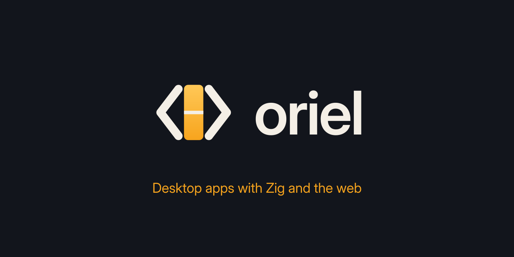

<p align="center"></p>

<p align="center">
  <a href="#license"></a>
  
  
  
</p>

# Oriel

**Desktop and mobile apps with Zig and the web.** Oriel is a Tauri-like framework in
Zig 0.16: a native window with the system webview, your frontend (React, Vite,
plain HTML…) embedded in a small binary, and typed JS ↔ Zig calls generated
from plain Zig structs. It targets Linux, Windows, macOS, Android and iOS
(iOS is verified in the simulator; device testing is next). An optional
[native renderer](docs/renderers.md#native-renderer-experimental) runs the same frontend
without a WebView.

- **Small:** a release app is a few MB; the build cache is hundreds of MB, not gigabytes.
- **Typed both ways:** `invoke` and `listen` in TypeScript are generated from your Zig `Commands` and `Events`.
- **Secure by default:** navigation limits, per-origin command capabilities, a strict CSP.
- **Batteries included, opt-in:** tray, updater, SQLite & sqlite-vec, llama.cpp & whisper.cpp, file watching, dialogs, notifications, global shortcuts, clipboard, packaging (deb, rpm, AppImage).

```sh
curl -fsSL https://raw.githubusercontent.com/highercomve/Oriel/main/install.sh | sh     # Linux, macOS
# Windows (PowerShell): irm https://raw.githubusercontent.com/highercomve/Oriel/main/install.ps1 | iex
oriel doctor              # checks Zig 0.16, the platform webview SDK, Node.js
oriel init my-app         # React + Vite (or --template vue|svelte|vanilla)
cd my-app && oriel dev    # hot reload; `oriel build` for the release binary
```

## Renderers

Use the system WebView, or build with `-Dnative_ui` to render HTML, CSS and
JavaScript with QuickJS, Oriel’s native DOM, Yoga, and platform drawing.
The native renderer is experimental; see its [support and limits](docs/native-renderer.md)
and [performance measurements](docs/native-renderer-performance.md).

## Examples

- [Showcase](docs/examples.md#showcase): windows, local AI, dictation, SQLite, notifications, and more on desktop and mobile.
- [Breakout](docs/examples.md#breakout): the same canvas game in the WebView and native renderer, with JavaScript or Zig physics.
- [Smoke test](docs/examples.md#smoke-test): end-to-end checks for modules and security.
- [Render bench](docs/examples.md#render-bench) and [canvas demo](docs/examples.md#canvas-demo): rendering measurements and 2D drawing.

[GhostPen](https://github.com/highercomve/GhostPen) is a desktop AI editor built
with Oriel. See [apps and examples](docs/examples.md) for screenshots and details.

## Documentation

Start with the [documentation index](docs/README.md), or go straight to a guide:

| Guide | Contents |
|---|---|
| [CLI](docs/cli.md) | Install, scaffold, develop, manage tools, and update the CLI |
| [Building apps](docs/app-development.md) | Build configuration, typed IPC, events, security, permissions, tray, and windows |
| [Modules and plugins](docs/modules.md) | Shortcuts, clipboard, dialogs, notifications, storage, SQL, and deep links |
| [Local AI](docs/local-ai.md) | llama.cpp, whisper.cpp, GPU backends, chat, and dictation |
| [Application updates](docs/updater.md) | Signed manifests, update payloads, and runtime APIs |
| [Packaging](docs/packaging.md) | Linux packages, Windows installers, macOS bundles, and signing |
| [Platforms](docs/platforms.md) | Desktop support, prerequisites, and cross-compilation |
| [Android](docs/android.md) · [iOS](docs/ios.md) | Mobile setup, builds, and platform behavior |
| [Native rendering](docs/renderers.md) | Renderer overview, implementation guides, and limits |
| [Contributing](docs/contributing.md) | Repository layout, builds, tests, development rules, and releases |
| [Background and comparisons](docs/overview.md) | The Oriel name and comparisons with other frameworks |

## Project status

Oriel is experimental and APIs will change. It targets Linux, Windows,
macOS, Android, and iOS; see the [platform guide](docs/platforms.md) and
mobile guides for verification details and limitations.

[Changelog](CHANGELOG.md) · [Project background](IDEA.md) · [Dependencies](LIBRARIES.md)

## License

MIT: see [LICENSE](LICENSE). Contributions are accepted under the same license.
